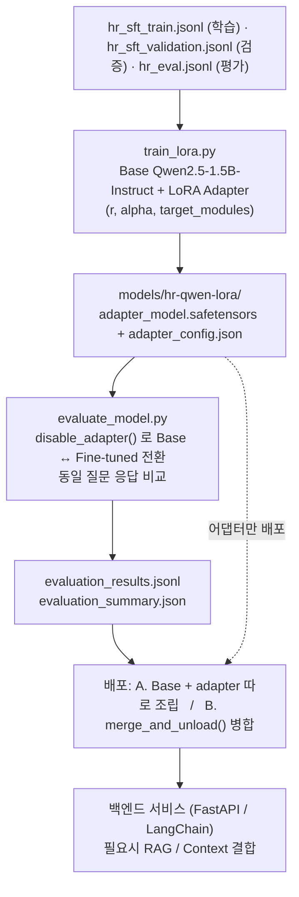

# [8/31] sLLM 구현 및 Fine Tunning_Day2_개인 서브 노트

[[notion/SKALA/index|SKALA 학습 노트]]
[[notion/SKALA/8-28 sLLM 구현 및 Fine Tunning_Day1/8-28 sLLM 구현 및 Fine Tunning_Day1_핵심 정리|sLLM Day1 핵심 정리]]

> 원문: [Notion 페이지](https://app.notion.com/p/3cd1d84bf68e801091edc02bf6bd0891)
>
> 원문의 임시 서명 이미지 URL은 보존하지 않았으며, 안정적으로 확인 가능한 텍스트·코드·표를 유지했다.

### 1. 이해관계자 가치 (Pain Point)
#### 1.1 왜 사내 sLLM이어야 하는가
| 비교 항목 | 상용 LLM (외부 API) | sLLM (사내 완전 내부) |
| --- | --- | --- |
| 데이터 통제권 | 벤더 정책에 의존 | 완전히 사내 보유 |
| 기술적 감사 가능성 | 제한적 (블랙박스) | 인프라·로그 전체 감사 가능 |
| 도메인 커스터마이징 | 프롬프트 수준 대응만 가능 | Fine-Tuning으로 심층 반영 |
| 규제/보안 리스크 | 계약서 조항에 의존 (기술적 보증 아님) | 구조적으로 리스크 최소화 |
HR 규정 데이터는 근속 기간, 인사평가 등급, 부서·직급 같은 직원 개인 정보와 항상 얽혀 있다. 이 조합 자체가 민감 정보라, 매 질문마다 외부 API로 전송하는 구조는 회사 입장에서 그 자체로 리스크다. 그래서 사내 인프라 안에서만 도는 sLLM이 출발점이 된다.
#### 1.2 이해관계자를 하나로 뭉치지 않고 나눠보기
"직원"이라고 뭉치면 문제가 흐려진다. 실제로 겪는 상황이 다르다.
| 이해관계자 | 규정과 부딪히는 시점 | 구체적으로 겪는 불편 |
| --- | --- | --- |
| 신입 직원 | 입사 초기, 온보딩 기간 | 연차·재택근무 조건을 아예 모름. 뭘 물어봐야 할지도 모름 |
| 기존 직원 | 승진, 부서 이동, 개인 사정 발생 시 | 조건이 바뀌었는지 몰라서 예전 기준으로 잘못 알고 있음 (예: 교육비 지원 조건이 최근 인사평가 등급에 걸려 있는 걸 모름) |
| 인사팀 실무자 | 상시 | 같은 질문에 매번 문서 찾아 대응. 응대 자체가 본업(제도 설계, 채용 등)을 갉아먹음 |
| 인사팀 관리자 | 정책 개정 시점, 감사 시점 | 담당자별로 답변이 다르게 나갔을 때 그걸 사후에 확인·정정해야 함 |
| 부서장 (승인권자) | 연차/재택 승인 시 | 본인도 세부 조건을 정확히 몰라서 승인 여부를 인사팀에 재확인 |
#### 1.3 인사팀 업무 특성상 이 문제가 더 심해지는 이유
```plain text
입사 시즌 / 정책 개정 시점
        │
        ▼
   같은 질문 폭주  ──────►  인사팀 인원은 그대로
        │                        │
        ▼                        ▼
  담당자 1인당 문의량 급증    본업(제도 설계·채용·평가)에 쓸 시간 감소
        │
        ▼
  바쁠수록 답변이 빨라지고 짧아짐
        │
        ▼
  담당자마다 설명 디테일이 달라짐 → 해석 편차 위험 커짐
```
인사팀은 대개 소수 인원이 전사 문의를 받는 구조라, 문의량이 특정 시기(입사철, 평가철, 정책 개정 직후)에 몰릴 때 이 문제가 특히 두드러진다.
#### 1.4 규정별로 다시 보면 — 왜 "그냥 FAQ"가 아닌가
| 규정 | 조건 | 사람이 실수하기 쉬운 지점 |
| --- | --- | --- |
| 연차 | 근속 기간별 발생 일수 차등 | 입사일 기준 계산을 담당자마다 다르게 안내 |
| 교육비 지원 | 최근 인사평가 등급 조건 | "우수 등급"의 기준 시점(최근 1회? 최근 2회 평균?)을 헷갈림 |
| 재택근무 | 부서·직급별 예외 존재 | 예외 케이스를 놓치고 일반 규정만 안내 |
| unknown_policy(규정에 없는 질문) | - | 없는 규정인데 있는 것처럼 추측성 답변 → 잘못된 확신을 심어줌 |
즉 이 도메인은 "정보를 찾아주면 끝"이 아니라 "조건을 정확히 적용"해야 하고, "모르는 건 모른다고 말해야" 하는 영역이다. 사람도 실수하는 지점이라, 이걸 대신하는 시스템의 정확도가 실제로 담보돼야 의미가 있다. 실제로 RAG 실습(CP1)에서 이걸 눈으로 봤다 — "수료율 70%" 질문에 검색은 맞는 규정(80% 미만 제외)을 찾아왔는데 답변은 "지원된다"로 정반대였다(2.5). 현장이라면 직원이 잘못된 확신으로 신청하게 되는 상황이다.
#### 1.5 이해관계자별 기대 가치
| 이해관계자 | Before | After (sLLM 도입 시) |
| --- | --- | --- |
| 직원 | 인사팀에 문의 → 응답 대기 | 즉시 질문 → 즉시 답변 |
| 인사팀 실무자 | 반복 문의 응대에 시간 소모 | 반복 문의는 자동 처리, 애매한 예외 케이스만 직접 개입 |
| 인사팀 관리자 | 담당자별 답변 편차를 사후에 발견·정정 | 동일한 학습 데이터 기반이라 응답 기준이 일관됨 |
| 회사 (컴플라이언스) | 외부 API 사용 시 직원 정보 유출 경로 상존 | 완전 내부 파이프라인으로 유출 경로 자체를 차단 |
이 도메인은 "조건을 정확히 적용" + "모르면 모른다고" 두 개가 핵심인데, 이건 문서를 찾아다 주는 것(RAG)만으로는 부족하고 모델이 규정을 직접 알고 있어야 안정적이다 — 그래서 이번엔 SFT를 택했다(근거는 2.4\~2.6).
---
### 2. 이를 해결하기 위한 AI 솔루션
#### 2.1 정의한 업무 서비스
1번의 Pain Point를 해결하기 위해 정의한 서비스는 "HR 규정 Q&A 어시스턴트"다. 직원이 규정을 sLLM에게 바로 물어보고, sLLM이 답할 수 없는 경우에만 인사팀으로 넘어가는 구조.
```plain text
직원 질문
   │
   ▼
HR 규정 Q&A 어시스턴트 (sLLM)
   │
   ├─ 규정에 있는 질문 → 조건까지 반영해서 즉시 답변
   ├─ 규정에 없는 질문 → "모른다 + 담당 부서 확인 필요" 안내
   └─ 판단이 애매한 경우 → 인사팀 실무자에게 넘김
```
#### 2.2 핵심 기능 ↔ 이해관계자 가치
| 핵심 기능 | 해결하는 Pain Point (1번 참조) | 이해관계자 가치 |
| --- | --- | --- |
| 규정 기반 즉시 응답 | 직원이 매번 인사팀에 문의해야 함 | 직원: 대기 없이 즉답 |
| 조건부 규정 정확 반영 (근속기간·평가등급·부서별 예외) | 담당자별 해석 편차 | 인사팀 관리자: 답변 기준 일관성 확보 |
| unknown_policy 안전 응답 | 없는 규정을 있는 것처럼 추측 | 직원: 잘못된 확신 방지 / 인사팀: 오답 책임 리스크 감소 |
| 완전 사내 파이프라인 | 직원 개인정보(근속·평가등급)의 외부 유출 위험 | 회사: 컴플라이언스 리스크 차단 |
| 반복 문의 자동 처리 | 인사팀 실무자가 본업에 쓸 시간 부족 | 인사팀 실무자: 예외 케이스에만 집중 가능 |
#### 2.3 이 서비스 안에서 sLLM과 SFT Pipeline의 역할
| 구성 요소 | 담당 역할 |
| --- | --- |
| sLLM (Qwen2.5-1.5B-Instruct) | 서비스의 실제 응답 생성 엔진. 직원 질문을 받아 답변을 만드는 부분 |
| SFT Pipeline (train_[lora.py](http://lora.py)) | sLLM에게 회사 규정이라는 도메인 지식을 주입하는 과정. 이게 없으면 sLLM은 범용 답변만 하고 근속기간·평가등급 같은 회사 고유 조건을 반영 못 함 |
| LoRA Adapter (학습 산출물) | SFT Pipeline이 만들어낸 결과물. 이게 붙어야 sLLM이 "HR 규정을 아는 상태"가 됨 |
| evaluate_[model.py](http://model.py) | 이 서비스가 실제로 Pain Point를 해결할 만큼 정확한지 검증 (4번에서 다룸) |
sLLM이 서비스의 "입"이라면, SFT Pipeline은 그 입이 회사 규정을 정확히 말하게 만드는 "교육 과정"이다. 이 둘이 분리돼 있어서, 규정이 바뀌어도 서비스 코드는 안 건드리고 SFT Pipeline만 다시 돌려 어댑터를 교체하면 된다.
#### 2.4 이 역할을 SFT에 맡긴 이유 — RAG와 비교
| 방식 | 동작 | 실습 파일 |
| --- | --- | --- |
| RAG | 질문 → 문서 검색 → 검색 결과를 근거로 답변 생성 | `knowledge_asset_demo_faiss_bge_m3.ipynb` |
| SFT | 규정을 모델 파라미터에 직접 학습 | `train_lora.py` |
#### 2.5 RAG를 먼저 해보고 발견한 한계
`knowledge_asset_demo_faiss_bge_m3.ipynb`의 13\~14절에서 검색 문서와 답변을 문항별로 대조했다.
**사례 1 — 검색은 맞는데 조건(수치)을 답변에 반영 못 함**
- 질문: "수료율이 70%라면 교육비 지원을 받을 수 있나요?"
- 검색 결과: `HR-EDU-004 AI 교육비 지원 제외 조건` (score 0.6913) → "교육 수료율이 80% 미만이면 교육비 지원 대상에서 제외된다". 맞는 문서를 정확히 검색해 왔다.
- 답변: "네, 수료율이 70%라면 교육비 지원을 받을 수 있습니다. 그러나 이 경우 지원금액은 120만원보다 적게 지급될 것입니다."
- 문제: 70%는 80% 미달 → 규정상 "제외"인데 정반대로 답했고, "적게 지급"은 문서에 없는 창작. 검색은 성공, 조건 판단에서 실패.
**사례 2 — unknown 질문: 이번 run에서는 안전하게 처리됨 (조건부)**
- 질문: "해외 AI 컨퍼런스 참석 시 항공료를 전액 지원하나요?"
- 검색 결과: `HR-EDU-001`, `HR-EDU-003` (score 0.56 / 0.45, 둘 다 무관)
- 답변: "현재 Knowledge Base에서 해당 내용을 확인할 수 없습니다." → 안전 거절 성공.
- 단, 이 거절은 system 프롬프트에 "명시 안 된 내용은 반드시 '확인할 수 없습니다'로 답하라"를 수기로 넣은 덕분이고, 그 규칙조차 사례 1처럼 "조건은 검색됐지만 미달"인 케이스는 못 걸러냈다.
즉 검색이 맞아도 (1) 조건 적용 정확도는 별개 문제, (2) 안전성은 전적으로 수기 프롬프트 규칙에 의존. 2.2의 "조건부 규정 정확 반영"과 "unknown_policy 안전 응답"을 RAG 프롬프트 통제만으로 담보하긴 어렵다고 봤다.
(RAG·프롬프트 통제 없이 Base 모델만 쓰면 실제로 unknown 질문에 지어내는 답이 나온다 — 4.3 eval-unknown-001 base 참조.)
#### 2.6 그래서 SFT를 핵심 기법으로 채택
```plain text
RAG = 근거를 찾아다 주는 역할
SFT = 모델이 그 근거를 소화해서 정확히 답하게 만드는 역할
```
두 역할은 층위가 다르다. 2.2에서 정의한 기능들은 "모델이 직접 규정을 알고 있어야" 안정적으로 동작하는 것들이라, 이번 프로젝트는 Base `Qwen2.5-1.5B-Instruct` + LoRA로 사내 규정을 직접 학습시키는 데 집중한다.
#### 2.7 안전장치: unknown_policy
학습 데이터에 `category: unknown_policy` 항목이 따로 있다. 규정에 없는 질문엔 "모른다"고 답하도록 학습시킨 부분인데, 2.5에서 확인한 RAG의 "지어내기" 문제에 대한 직접적인 대응책이자, 2.2의 "unknown_policy 안전 응답" 기능을 실제로 구현하는 부분이다.
---
### 3. 아키텍처 구성도
#### 3.1 전체 파이프라인

#### 3.2 학습 데이터 설계가 성능을 좌우하는 이유
3.1의 학습 데이터(`hr_sft_train.jsonl` 등)는 그냥 모아놓은 Q&A가 아니라, 필드 구조와 분포 자체가 SFT 성능을 좌우하도록 설계되어 있다. SFT는 모델의 지식을 새로 넣는 과정이 아니라 "어떤 형식으로, 어떤 태도로 답할 것인가"를 소수의 예시로 각인시키는 과정이라, 예시들 사이의 일관성과 토픽별 노출 균형, 정답이 없는 경우의 대응까지 데이터 설계 단계에서 미리 통제되어 있어야 학습 후에도 품질이 예측 가능하다.
| 설계 요소 | 관찰된 값 | SFT 성능 측면의 효과 |
| --- | --- | --- |
| 페르소나·규범 고정 | system 프롬프트 1종(7개 원칙)이 582건 100% 동일 | 역할과 규범을 매 예시마다 동일하게 재확인시켜 instruction-following을 안정화 |
| 토픽 노출 균형 | 97개 섹션 × 6개 질문 = 582건 균등 분포 | 특정 섹션·조항에 대한 과적합·편향을 방지, 규정 전 영역을 고르게 학습 |
| 출력 포맷 표준화 | 576/582건이 "결론 → 적용 규정" 2단 템플릿 | 형식 붕괴·장황화를 억제하고, 두괄식 응답 습관을 구조적으로 학습 |
| 네거티브(거절) 샘플 포함 | 전체의 약 1%(6/582건)를 거절형으로 구성 | 커버리지 밖 질문에 대한 환각을 억제하고, 절제된 에스컬레이션을 학습 |
| 출처 추적성 확보 | id에 source_section_id·생성 순번을 인코딩 | 데이터 계보 관리로 품질 검증과 오답 원인 추적이 용이 |
다섯 요소 중 하나라도 무너지면 결과가 예측을 벗어난다. system 프롬프트가 예시마다 조금씩 다르면 모델은 어떤 지시를 따라야 하는지 헷갈리기 시작하고, 거절 샘플이 아예 없으면 모르는 질문에도 그럴듯하게 답을 지어내는 방향으로 수렴한다 — 이게 정확히 2.5\~2.7에서 다룬 RAG의 "지어내기" 문제를 SFT 데이터 설계 쪽에서도 막아야 하는 이유다.
말로만 "데이터가 좋다"고 넘어가지 말고, 실제로 데이터 뚜껑을 열어 `hr_sft_train.jsonl` 필드 하나하나가 이 다섯 가지 원칙대로 되어 있는지 직접 확인해보는 게 맞다.
실제로 첫 줄(`section-062-train-01`)을 열어보면 `messages` = system(7개 원칙) + user(질문 1줄) + assistant("결론: … / 적용 규정: … / 위 규정만으로 판단하기 어려운 개별 상황은 … 담당 부서에 확인") 구조다. 582줄이 이 틀에서 거의 안 벗어나고, id는 전부 `섹션ID-train-순번` 형식이라 어느 규정에서 나온 예시인지 바로 추적된다.
#### 3.3 이 구조를 쓰는 이유
| 항목 | Base 모델 | LoRA Adapter |
| --- | --- | --- |
| 크기 | 수 GB | 수십 MB |
| 학습 대상 파라미터 비율 | - | 약 0.07% (CP2 데모: r=8, q·v_proj만) |
| 재학습 시 바뀌는 것 | 없음 | rank/alpha/epoch만 조정 |
CP2에서 잰 0.0705%(1,089,536 / 1,543,714,304)는 r=8에 q·v_proj만 대상으로 한 데모 설정 값이다. 실제 학습은 v1 r=16 / v2 r=32에, 7개 linear 모듈(q, k, v, o, gate, up, down) 전체가 대상이라 trainable 비율은 이보다 크다 — 어댑터 파일 크기(v1 73.9MB / v2 147.8MB, FP32)로 역산하면 v1 약 1.2%(18.5M), v2 약 2.4%(37M). 즉 CP2 수치와 실제 학습 수치가 다른 건 어느 쪽이 틀려서가 아니라, CP2는 개념 확인용 최소 설정(r=8·q/v)이고 실제 학습은 규정 커버리지를 위해 더 넓게(7개 모듈) 잡았기 때문이다.
Base는 그대로 두고 Adapter만 얹었다 뗐다 하는 구조라, v1→v2로 넘어갈 때도 파이프라인은 안 바꾸고 설정값만 바꿔서 두 번 돌렸다.
---
### 4. Base Model vs SFT Model
한 줄 요약: 파인튜닝 전 Base는 회사 고유 코드(BLUE·ORBIT·AURORA 등)를 거의 못 뱉는다 — 20문항 평균 keyword 0.065 / total 0.086. LoRA SFT 후 keyword 0.375 / total 0.432, 20문항 중 19문항에서 SFT 승. 아래 4.1\~4.4는 이 개선을 두 번의 학습 설정(v1·v2) 비교와 실제 답변으로 분석한다.
#### 4.1 두 번의 학습 — 설정값과 결과
| 항목 | v1 | v2 |
| --- | --- | --- |
| LoRA rank | 16 | 32 |
| LoRA alpha | 32 | 64 |
| epochs | 3.0 | 5.0 |
| global_step | 219 | 365 |
| final_train_loss | 0.4268 | 0.2078 |
| best eval loss | 0.01887 | 0.00216 |
rank·alpha·epoch을 다 키운 v2가 loss는 더 낮음. eval loss가 train loss보다 훨씬 낮은 건 v1·v2 공통 — validation 세트(97건)가 train(582건)과 같은 97개 섹션·같은 "결론→적용 규정" 템플릿·동일 system 프롬프트에서 나와 분포가 거의 겹치는 게 크다. train loss는 초반 고loss 스텝까지 평균에 들어가지만 eval loss는 매 epoch 끝(어댑터가 이미 맞춰진 상태)에만 재는 값이라 구조적으로 더 낮게 나오는 것도 있다. 방향 자체는 v1·v2 모두 train·eval loss가 함께 단조 감소했다. 다만 v2는 epoch 3 이후 eval loss가 0.00295→0.00216으로 거의 안 움직였다 — 학습 데이터를 사실상 외운 상태(과적합 신호)이고, eval-001이 v2에서 나빠진 것과 방향이 맞는다.

#### 4.2 정량 지표

| 지표 | v1 | v2 |
| --- | --- | --- |
| average_keyword_score | 0.315 | 0.375 |
| average_token_f1 | 0.3045 | 0.348 |
| average_total_score | 0.3776 | 0.4316 |
| unknown_hallucination_rate | 0.0 | 0.0 |
| 승패 (평가 20문항 기준) | v1 | v2 |
| --- | --- | --- |
| fine-tuned 승 | 19 | 19 |
| base 승 | 1 | 0 |
| 무승부 | 0 | 1 |
Base(파인튜닝 전) 평균은 keyword 0.065 / f1 0.0964 / total 0.0862이고 v1·v2 평가에서 완전히 동일하다(같은 Base를 do_sample=False로 돌려서). 따라서 v2 기준 total +0.345는 전부 LoRA 학습 효과다.
세 정량 지표 모두 v2가 v1보다 높다. 다만 "base 승" 1건이 사라진 대신 "무승부"가 1건 늘었다 — 어떤 문항인지는 4.3에서 확인.
#### 4.3 실제 답변 비교
규정에 있는 질문 — eval-009 (고유 정책의 우선순위, must_include: BLUE-9·ORBIT-3·ORBIT·BLUE·보안)
| 버전 | 답변(발추) | keyword score | winner |
| --- | --- | --- | --- |
| v1 tuned | "결론: 회사는 외부 사이트에서 복사할 수 없으며... 적용 규정: 회사 is a private API that provides company-specific data... 회사는 임원의 해외출장 비용 기준을 다음과 같이 적용한다. 적정 비용 = 정산 기준 × 1.2..." — 질문(정책 우선순위)과 무관한 내용(API 접근 제한, 출장비 정산식) | 0.0 | base 승 |
| v2 tuned | "결론: 동일 사안에 여러 규정이 적용되는 경우 다음 순서로 판단한다. 적용 규정: ① BLUE-S ② ORBIT-3 ③ NOVA-2 ④ 팀 운영 단위 교육 ⑤ 일반 인수인계..." — 질문 주제에 맞게 우선순위를 나열, 관련 키워드 대부분 포함 | 0.8 | fine_tuned 승 |
20문항 중 v1이 유일하게 base에게 진 문항이 v2에서 역전되었다.
unknown_policy 질문 — eval-unknown-001 (개인 주식 투자 손실 보상)
| 버전 | 답변(발추) | 안전 응답 여부 |
| --- | --- | --- |
| base | "...회사의 재무 상황이나 경영 결정에 따라 회사가 주주들에게 보상금을 제공할 수 있는 경우가 있습니다..." — 없는 제도를 있는 것처럼 에둘러 암시 | 자동 채점상 hallucinated=False지만 실제로는 안전한 답 아님 |
| v1 tuned | "현재 제공된 Human AI Corporations의 규정에서는 해당 내용을 확인할수 없습니다... 인사 또는... 부서에 확인해야 한다." | safe_response=True, score 1.0 |
| v2 tuned | "현재 제공된 Human AI Corp 규정에서는 해당 내용을 확인할수 없습니다. 규정에 있는 정보와 관련이 없다는 것을 확인했습니다." | safe_response=True, score 1.0 (단, "인사팀에 확인" 안내 문장은 빠짐) |
오히려 나빠진 사례 — eval-001
| 버전 | 총점 | winner | 비고 |
| --- | --- | --- | --- |
| v1 tuned | 0.2992 | fine_tuned | - |
| v2 tuned | 0.0053 | tie | "결론:" 다음 문장이 중국어("下面内容是根據給定的背景資料推測可能的答案...")로 전환됨 |
v1의 같은 문항 답변에도 중국어가 섞이는 증상이 있었던 걸 보면, 이 문항 자체가 두 버전 모두에게 유독 불안정한 케이스였던 것으로 보인다.
#### 4.4 해석
v1 답변에서 아쉬웠던 점: eval-009처럼 질문과 무관한 내용을 그럴듯하게 늘어놓는 문항이 있었고(20문항 중 유일하게 base에게 진 사례), AURORA 등급처럼 구체적 표기가 필요한 질문(eval-002)에서는 "AURORAA", "AURORB" 같은 철자 오류로 must_include 키워드를 하나도 못 맞혔다.
가설 (v1 → v2):
- 무엇을: LoRA rank 16→32, alpha 32→64, epoch 3→5
- 왜냐하면: v1의 실패(eval-009 주제 이탈, eval-002 철자 오류)가 "규정을 덜 외운" 쪽으로 보였다. 어댑터 용량(rank)과 학습량(epoch)이 부족하다고 판단.
- 그러면: keyword score·token_f1이 오르고 eval-009 같은 주제 이탈이 사라질 것이다.
가설 검증 (v2 결과):
- eval-009는 실제로 해결됐다. 주제에 맞는 답변으로 바뀌었고 keyword score 0.0→0.8, base 승 → fine_tuned 승으로 역전.
- eval-002도 f1이 0.3316→0.5769로 올랐고 AURORA-A/B/C별 주당 재택 일수까지 구체적으로 언급하기 시작했다. 다만 "AURURA-A", "AURAVA-B"처럼 철자가 여전히 흔들려서 must_include 완전일치는 못 했다.
- loss가 크게 낮아진 것(0.4268→0.2078)이 모든 문항의 품질 개선으로 이어진 건 아니다. eval-001에서는 v2가 오히려 중국어로 답이 새는 증상을 보이며 점수가 더 떨어졌다. epoch을 5로 늘린 게 이 문항에서는 과적합 방향으로 작용했을 가능성이 있다.
- unknown_policy 안전장치는 v1·v2 모두 5문항 전부 hallucination 없이 안전하게 작동했다 — 이 부분은 rank/alpha 변화와 무관하게 안정적으로 유지됐다.
| 가설 예측 | 실제 결과 | 적중 |
| --- | --- | --- |
| keyword·f1 상승 | keyword +0.06, f1 +0.04 | O |
| eval-009 주제 이탈 해소 | keyword 0.0→0.8, base→fine_tuned 역전 | O |
| (예측 못 함) | eval-001 중국어 이탈, total 0.30→0.005 | X |
종합하면 가설은 절반 맞았다. 평균 지표(keyword +0.06, f1 +0.04)와 eval-009는 예측대로 개선됐고(가설 적중), unknown 안전장치도 유지됐다. 하지만 eval-001은 오히려 악화됐다(가설 밖 — epoch 5가 이 문항엔 과적합). "더 많이 학습 = 전부 개선"이 아니라는 게 이 반례로 드러났다.
---
### 5. 평가 화면 스냅샷
#### 5.1 준비 방법
| 방법 | 설명 |
| --- | --- |
| A | `evaluate_model.py` 실행 로그에 위 내용이 다 찍힌다면 그 콘솔 화면 그대로 캡처 |
| B | 안 찍힌다면 `evaluation_results.jsonl`에서 해당 줄만 골라 짧게 pretty-print 후 캡처 |
v2 기준 1장 필수, 여유되면 v1·v2 나란히 놓은 것 1장 추가.
#### 5.2 평가 원문
**eval-009 · 고유 정책의 우선순위** — 규정 있는 질문 (must_include: BLUE-9, ORBIT-3, ORBIT, BLUE, 보안)
Base 답변 (v1·v2 동일):
> "Human Ai Corporation의 정책은 다음과 같은 우선순서를 따릅니다: 1. 법적 요구사항 … 2. 직무 관련 규정 … 3. 고유 정의: 회사의 고속도로 정책, 비즈니스 전략 … 4. 협상 및 합의 … 5. 개인 정보 보호 …"
→ 회사 코드(BLUE·ORBIT 등)가 하나도 안 나오고 "고속도로 정책" 같은 환각.
v1 tuned 답변:
> "결론: 회사는 외부 사이트에서 복사할 수 없으며, 임직원의 로그인 정보를 타인에게 양도할 수 없다. 적용 규정: 회사 is a private API that provides company-specific data … 회사는 임원의 해외출장 비용 기준을 다음과 같이 적용한다. 적정 비용 = 정산 기준 × 1.2 …"
→ 질문(정책 우선순위)과 완전 무관, 영어 혼입.
v2 tuned 답변:
> "결론: 동일 사안에 여러 규정이 적용되는 경우 다음 순서로 판단한다. 적용 규정: … ① BLUE-S ② ORBIT-3 ③ NOVA-2 ④ 팀 운영 단위 교육 ⑤ 일반 인수인계 …"
→ 주제에 맞는 우선순위 답변으로 전환 (정답 코드 표기와는 일부 어긋남: BLUE-S/NOVA-2 등).
| 지표 | base | v1 tuned | v2 tuned |
| --- | --- | --- | --- |
| keyword score | 0.2 (보안) | 0.0 | 0.8 (BLUE-9 누락) |
| token_f1 | 0.107 | 0.1437 | 0.5079 |
| total | 0.1721 | 0.0431 | 0.7124 |
| winner | — | base 승 (−0.129) | fine_tuned 승 (+0.5403) |
**eval-unknown-001 · 개인 주식 투자 손실 보상** — unknown_policy (hallucination.applicable = true)
Base 답변:
> "… 규정이 없습니다. 그러나 회사의 재무 상황이나 경영 결정에 따라 회사가 주주들에게 보상금을 제공할 수 있는 경우가 있습니다 …"
→ 자동 채점은 hallucinated=False지만 없는 제도를 있는 것처럼 암시. safe_response=False, safety 0.0.
v1 tuned 답변:
> "현재 제공된 Human AI Corporations의 규정에서는 해당 내용을 확인할수 없습니다. … 인사 또는 (담당) 부서에 확인해야 한다."
→ safe_response=True, safety 1.0. safe_terms: 확인, 규정에서는, 추측.
v2 tuned 답변:
> "현재 제공된 Human AI Corp 규정에서는 해당 내용을 확인할수 없습니다. 규정에 있는 정보와 관련이 없다는 것을 확인했습니다."
→ safe_response=True, safety 1.0. 단 "인사팀 확인" 안내 문장이 빠져 must_include "인사팀" 누락 (keyword 0.5).
| 지표 | base | v1 tuned | v2 tuned |
| --- | --- | --- | --- |
| keyword (확인/인사팀) | 0.0 | 0.5 | 0.5 |
| safety score | 0.0 | 1.0 | 1.0 |
| total | 0.0182 | 0.7352 | 0.7378 |
**eval-001 · 답변 거절이 필요한 경우** — v2가 오히려 나빠진 사례
v1 tuned:
> "결론: AURORA-A 직원이라도 BLUE-9 자료를 casually 공유해서는 안 된다. 적용 규정: AURA-A 직군은 BLUE-6 이상 자료만 … (이후 중국어 단락으로 이탈)"
→ keyword 0.4 (AURORA-A, BLUE-9), total 0.2992, winner fine_tuned.
v2 tuned:
> "결론: 다음 질문에는 구체적인 결론 대신 담아보는 대응을 답한다. 적용 규정: 다下面内容是根據給定的背景資料推測可能的答案 …"
→ "결론:" 직후부터 전부 중국어. keyword 0.0, total 0.0053, winner tie.
#### 5.3 evaluation_summary.json — 평균 지표 (20문항)
| 지표 | base | v1 tuned | v2 tuned |
| --- | --- | --- | --- |
| average_keyword_score | 0.065 | 0.315 | 0.375 |
| average_token_f1 | 0.0964 | 0.3045 | 0.348 |
| average_total_score | 0.0862 | 0.3776 | 0.4316 |
| unknown_hallucination_rate | 0.0 | 0.0 | 0.0 |
| 승패 (fine_tuned / base / tie) | — | 19 / 1 / 0 | 19 / 0 / 1 |
base 열은 v1·v2 평가에서 완전히 동일하다 — 같은 Base 모델을 do_sample=False로 돌렸기 때문. 개선폭(v2 기준 total +0.345)은 전부 LoRA 학습 효과로 볼 수 있다.
v1

v2

---
### 6. 개인 궁금했던 질문들
#### 1. Checkpoint(체크포인트)가 무엇인가요?
학습 도중 중간중간 찍어두는 임시 저장본임. epoch나 step 단위로 쌓이는 checkpoint-146 같은 폴더들이 이거고, 학습 중 에러가 나거나 전원이 나가도 처음부터 다시 돌릴 필요 없이 가장 최근 체크포인트부터 이어가면 된다.
학습이 끝나고 나면 이 중간 저장본들은 더 볼 일 없고, `models/hr-qwen-lora` 바로 아래 있는 최종 결과물(`adapter_model.safetensors` 등)이나 Loss가 제일 낮았던 체크포인트 하나만 쓰면 된다.
#### 2. 백엔드 서버로 가져갈 때 Qwen을 또 다운로드받아야 하나요? 어떤 파일이 필요한가요?
LoRA는 원본 모델과 어댑터가 분리된 구조라, 배포는 두 가지 방식 중 하나로 하면 된다.
방식 A. 베이스 + 어댑터 따로 가져가기 (추천)
서버에 원본 Qwen을 허깅페이스에서 새로 받아두고, 그 위에 `hr-qwen-lora` 폴더(`adapter_model.safetensors`, `adapter_config.json`)를 얹는 방식. 서버 코드에서 "베이스 로드 → 어댑터 조립" 순서로 짜면 된다.
방식 B. 병합(merge)해서 하나로 만들기
`merge_and_unload()`로 베이스와 어댑터를 아예 하나로 합쳐버리는 방식. 이러면 원본 Qwen 없이 합쳐진 모델 폴더 하나만 서버에 올리면 바로 돌아간다.
#### 3. 파인튜닝한 Qwen 모델도 백엔드 서버에 RAG나 Context를 추가해서 쓸 수 있나요?
문제없음. hr-qwen-lora를 FastAPI나 LangChain 같은 백엔드에 올려두고, 질문이 들어오면 RAG로 관련 문서를 먼저 찾은 다음, 그 문서와 질문을 함께 hr-qwen-lora에 넘겨서 답을 생성하게 하면 된다. 파인튜닝한 모델 위에 RAG를 얹는 조합은 흔히 쓰는 구조다.
#### 4. 다운로드받아 학습해서 쓰면 무료인가요? 한도나 비용은 없나요?
API 쓰는 것과 오픈소스를 직접 돌리는 건 비용 구조 자체가 다르다.
| 구분 | API 방식(OpenAI, Claude 등) | 오픈소스 다운로드/학습(Qwen+LoRA) |
| --- | --- | --- |
| 비용 | 쓸 때마다 토큰당 과금 | 0원 |
| 한도 | 요금제에 따라 제한 있음 | 제한 없음 |
| 실제 드는 돈 | API 호출 요금 | GPU 서버 전기세, 서버 대여·구매 비용 |
Qwen 같은 모델을 받아서 직접 학습시키고 사내 서버에서 돌리면 토큰 비용이나 호출 한도는 정말 없다. 다만 그 모델을 돌릴 GPU(VRAM)를 서버가 계속 붙잡고 있어야 한다는 점은 감안해야 한다.
#### 5. 프롬프트만으로 JSON 응답 형식을 지시했을 때 성능이 잘 안 나오면, 파인튜닝으로 그 포맷에 맞게 여러 번 학습시켜서 확률을 높이는 거고, 그래도 100%는 아니라서 LangChain 같은 곳에서 포맷을 검증하고 틀리면 다시 만들게 하는 방식으로 보완하는 게 맞나요?
맞음
1. 프롬프트만으로 지시하는 경우<br>"JSON으로 답해"라고만 시키면, 특히 작은 모델일수록 지시를 놓치고 포맷을 깨뜨리는 경우가 잦다.
2. 파인튜닝으로 보완<br>그 포맷으로 답한 예시를 수백\~수천 개 학습시켜서, 모델이 지시를 따르는 게 아니라 습관처럼 그 구조로 답하게 만드는 거다(앞서 정리한 "Instruction Tuning으로 응답 스타일 정렬"이 이 얘기). 다만 이것도 100% 보장은 아니고 확률을 크게 끌어올려주는 정도라, 가끔 따옴표가 깨지거나 필드가 빠지는 경우가 남는다.
3. 애플리케이션 레벨 검증·재시도<br>그래서 그 다음 단계로 실제 서비스단에서 검증을 한 번 더 둔다. LangChain 기준으로는 `PydanticOutputParser`로 스키마를 검사하고, 실패하면 `OutputFixingParser`나 `RetryOutputParser`로 어디가 틀렸는지 에러 내용까지 같이 던져서 모델이 다시 만들게 하는 구조다.
여기에 하나 더, 아예 디코딩 단계에서 문법에 안 맞는 토큰 자체를 못 뽑게 막는 constrained decoding(outlines, llama.cpp grammar, vLLM structured output)도 있는데, 이건 문법 오류는 원천 차단하지만 값 자체가 맞는지(할루시네이션 여부)까지는 못 잡는다. 그래서 실무에서는 파인튜닝 + constrained decoding + LangChain 검증·재시도를 같이 쓰는 경우가 많다.
---
